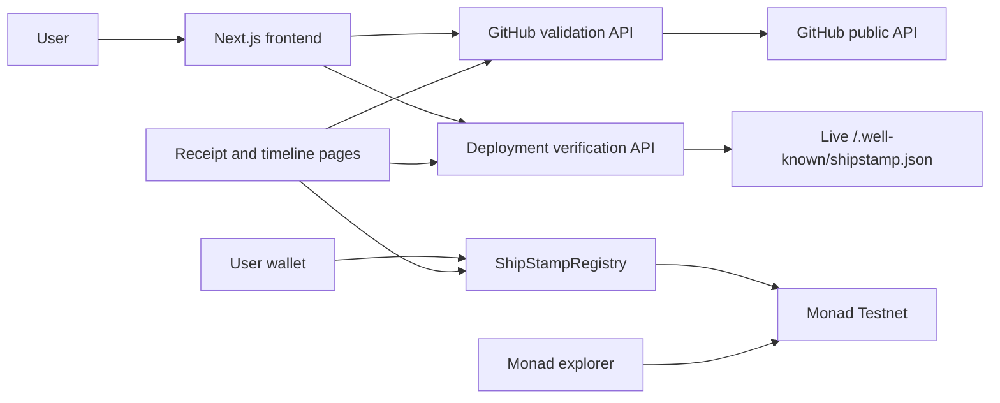

# ShipStamp

ShipStamp creates public software-build receipts connecting a real GitHub commit, a matching live deployment manifest, a builder wallet, and a Monad timestamp.

> Every build leaves a receipt.

## Why it exists

Indie builders publish apps, demos, client work, and hackathon projects continuously. A polished site or the current repository state does not show when one build was publicly connected to a deployment, which wallet made that statement, or how the project progressed.

The original ShipStamp model recorded a timestamped claim linking a repository, commit, deployment URL, milestone, and wallet. Live manifest verification was added because a claim alone did not demonstrate that the deployment participated. The current proof requires the deployment to serve a matching manifest before the transaction action becomes available.

ShipStamp does not prove that every deployed file was produced from the submitted commit. It proves that a live deployment publicly served a manifest connecting itself to a real GitHub commit and builder wallet, and that the matching manifest hash was recorded on Monad.

## Status and public links

- Live application: not deployed yet
- Example receipt: available after the first genuine onchain stamp
- Example project timeline: available after the first genuine onchain stamp
- Registry contract: not deployed yet
- Network: Monad Testnet, chain ID `10143`
- Explorer: [Monadscan Testnet](https://testnet.monadscan.com)
- Source: [github.com/kopachlager/ShipStamp](https://github.com/kopachlager/ShipStamp)

These values are intentionally not fabricated. They will be replaced only after deployment and a confirmed real transaction.

## Product flow

1. Connect an injected EVM wallet and select Monad Testnet.
2. Enter a project, public GitHub repository, full commit SHA, deployment origin, and milestone.
3. Verify the public repository and commit through the server-side GitHub API.
4. Copy or download the generated `shipstamp.json` manifest.
5. Publish it at `/.well-known/shipstamp.json` and redeploy the site.
6. Ask ShipStamp to verify the live manifest server-side.
7. Review the normalized fields and Solidity-compatible manifest hash.
8. Submit one real registry transaction and wait for confirmation.
9. Inspect or share the public receipt and chronological project timeline.
10. Recheck the currently served manifest from the public receipt.

## Architecture



There is no application database, account system, OAuth flow, backend indexer, upgrade proxy, or contract administrator. Contract state and events are authoritative for receipts; GitHub provides mutable display metadata.

## Manifest schema

Serve this strict version 1 JSON object:

```json
{
  "schemaVersion": "1",
  "project": "ShipStamp",
  "repository": "kopachlager/shipstamp",
  "commit": "aaaaaaaaaaaaaaaaaaaaaaaaaaaaaaaaaaaaaaaa",
  "deploymentUrl": "https://shipstamp.example",
  "wallet": "0x0000000000000000000000000000000000000001"
}
```

Unknown fields are rejected. `project` is trimmed and internal whitespace is collapsed. Repository and the full 40-character hexadecimal commit are lowercase. The deployment value is an HTTPS origin without credentials, custom ports, paths, queries, or fragments. Wallet comparison is case-insensitive and the normalized hash input uses the lowercase address. Field limits are enforced by shared validation and essential byte limits are repeated in the contract.

Installation:

- Next.js, Vite, or another static app: `public/.well-known/shipstamp.json`
- Other deployments: serve the exact JSON from `https://your-domain.example/.well-known/shipstamp.json`

## Canonical serialization and hashing

JSON whitespace and object property order are not hashed. The canonical field order is:

```text
schemaVersion
project
repository
commit
deploymentUrl
wallet
```

The frontend and contract calculate:

```solidity
keccak256(
  abi.encode(
    schemaVersion,
    project,
    repository,
    commit,
    deploymentUrl,
    normalizedWallet
  )
)
```

Fixed test vector:

```text
schemaVersion=1
project=ShipStamp
repository=kopachlager/shipstamp
commit=aaaaaaaaaaaaaaaaaaaaaaaaaaaaaaaaaaaaaaaa
deploymentUrl=https://shipstamp.example
wallet=0x0000000000000000000000000000000000000001

manifestHash=0x3be7a36e7fd8bda04f33ac7373e5a90b49467021bc334b32580f373d70c3526d
```

The human-readable lines above document the normalized values; the hash is produced with ABI encoding, not by hashing those lines or formatted JSON.

## GitHub and deployment verification

`POST /api/github/verify` accepts a supported GitHub repository URL and full commit SHA, confirms that the repository is public and the commit exists, and returns only required metadata. An optional server-side `GITHUB_TOKEN` improves API limits and is never sent to the browser.

`POST /api/deployment/verify` constructs the fixed manifest URL itself. It requires HTTPS origins, rejects credentials, paths, custom ports, localhost, local domains, private/loopback/link-local IP ranges, and known metadata hosts; resolves and checks DNS; manually validates up to three redirects; applies an eight-second timeout and 32 KB body limit; requires a JSON content type; rejects unknown schema fields; forwards no cookies or authorization headers; and returns structured safe errors. Requests are subject to an in-process per-client limit.

Public receipt rechecks compare the currently served canonical manifest hash with the recorded hash. A match is evidence about the current response, not proof that the deployment has remained unchanged continuously.

## Smart contract

`ShipStampRegistry` stores:

- sequential stamp ID and `msg.sender` builder
- project name and normalized repository
- lowercase full commit SHA and normalized deployment origin
- milestone and manifest hash
- proof schema version and Monad block timestamp

The contract recomputes the canonical manifest hash using `msg.sender`, so a caller cannot record a hash naming another builder. A duplicate is the same builder, repository, commit, deployment origin, and manifest hash. Changing only the milestone cannot create another receipt. A changed commit, deployment manifest, deployment origin, or wallet may create one.

Receipts cannot be edited or deleted. Repository-to-stamp arrays provide bounded chronological reads without relying on a third-party indexer. The contract is non-payable, non-upgradeable, and has no owner or administrative mutation.

## Local setup

Requirements: Node.js compatible with Next.js 16, npm, an injected EVM wallet, and Monad Foundry for contract work.

```bash
git clone https://github.com/kopachlager/ShipStamp.git
cd ShipStamp
npm install
cp .env.example .env.local
npm run dev
```

Open `http://localhost:3000`. A real contract address is required to submit transactions; GitHub and manifest verification can be developed before deployment.

### Environment variables

| Variable | Scope | Purpose |
| --- | --- | --- |
| `GITHUB_TOKEN` | server only, optional | GitHub REST API rate limits |
| `NEXT_PUBLIC_SHIPSTAMP_CONTRACT_ADDRESS` | browser/server | deployed registry address |
| `NEXT_PUBLIC_SHIPSTAMP_DEPLOYMENT_BLOCK` | browser/server | first block for event lookup |
| `NEXT_PUBLIC_MONAD_RPC_URL` | browser/server | Monad Testnet RPC override |
| `MONAD_TESTNET_RPC_URL` | contract CLI | deployment RPC override |
| `DEPLOYER_PRIVATE_KEY` | contract CLI only | CI fallback; local keystore preferred |
| `MONAD_EXPLORER_API_KEY` | contract CLI only | optional explorer verification |

Never commit `.env*`, keys, seeds, keystores, or tokens. Only variables prefixed `NEXT_PUBLIC_` enter browser bundles.

## Tests and builds

```bash
npm test
npm run typecheck
npm run lint
npm run build

cd contracts
forge fmt --check
forge build
forge test
```

Frontend/server tests focus on normalization, hash vectors, manifest generation, GitHub responses, form/network behavior, SSRF URL rules, redirects, response limits, mismatch states, and current-manifest comparison. Solidity tests cover receipt creation, emitted hashes, sender identity, duplicates, alternate valid proofs, limits, retrieval, chronology, and the shared fixed hash vector.

## Deployment

Contract deployment and verification are documented in [docs/deployment.md](docs/deployment.md). After a confirmed deployment, set the contract address and deployment block in Vercel, deploy the Next.js app, publish a real ShipStamp manifest referencing a completed commit, verify it through the app, and create the first genuine receipt. Vercel needs `GITHUB_TOKEN` only if higher unauthenticated GitHub limits are necessary; private deployment credentials must not be exposed as `NEXT_PUBLIC_` values.

## Security considerations and known limitations

- The contract cannot fetch GitHub or deployment URLs. The web verifier performs those checks and the wallet records the resulting hash.
- DNS is checked before each fetch and redirect, but the platform fetch API does not pin the inspected address; hostile DNS rebinding remains a deployment-platform consideration.
- The rate limiter is per process. Multi-instance production should use a shared limiter if abuse becomes material.
- Public RPC providers may rate-limit event reads; contract state remains authoritative and timelines use direct paginated calls.
- A deployment operator can change or remove the manifest after stamping. Receipt pages report only the result of the latest recheck.
- GitHub metadata can become unavailable even though the onchain receipt remains.
- Monad block timestamps are consensus timestamps, not precise wall-clock measurements.

## What ShipStamp proves

- A specified public GitHub commit existed when verification ran.
- A live deployment served a valid manifest referencing the repository and commit.
- That manifest named the same wallet that submitted the transaction.
- The matching canonical manifest hash was recorded on Monad.
- The wallet publicly recorded the receipt at the block timestamp.
- Anyone can recheck whether the currently served manifest still matches.

## What ShipStamp does not prove

- That every deployed file was compiled from the submitted commit.
- That the wallet owns the GitHub repository or matches its author.
- That the code is safe, original, or trustworthy.
- That the deployment has remained unchanged since the stamp.
- Legal ownership of the software.

## Hackathon context

ShipStamp is a new solo project for the BuildAnything Spark hackathon on Monad. This repository and its implementation were created during the hackathon. It does not reuse code, branding, contracts, infrastructure, or copied project structure from the author’s existing products.

## License

MIT
